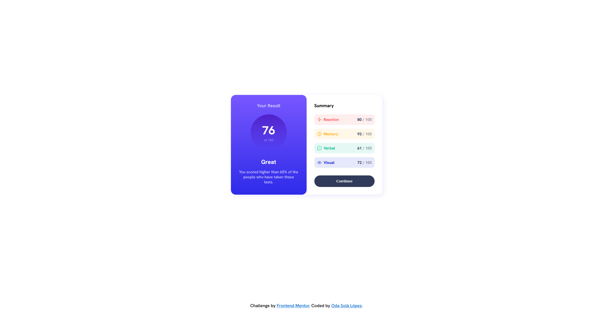
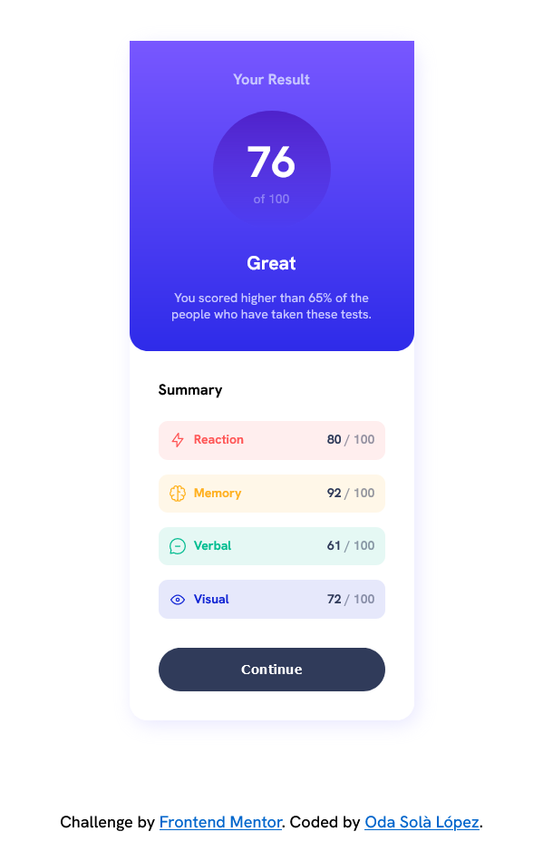

# Frontend Mentor - Results summary component solution

This is a solution to the [Results summary component challenge on Frontend Mentor](https://www.frontendmentor.io/challenges/results-summary-component-CE_K6s0maV). Frontend Mentor challenges help you improve your coding skills by building realistic projects.

## Table of contents

- [Overview](#overview)
  - [The challenge](#the-challenge)
  - [Screenshot](#screenshot)
- [My process](#my-process)
  - [Built with](#built-with)
  - [What I learned](#what-i-learned)
- [Author](#author)

## Overview

### The challenge

Users should be able to:

- View the optimal layout for the interface depending on their device's screen size
- See hover and focus states for all interactive elements on the page
- **Bonus**: Use the local JSON data to dynamically populate the content

### Screenshot

## My process

### Built with

- Semantic HTML5 markup
- CSS
- Flexbox
- MediaQueries
- JavaScript [Dinamic with JSON File]

### What I learned

JavaScript:
fetch function to read and use JSON files content.

## Author

- Website - [Oda Solà López](https://osolaldev.github.io/Personal-Site-English/)
- Frontend Mentor - [@yourusername](https://www.frontendmentor.io/profile/yourusername)
